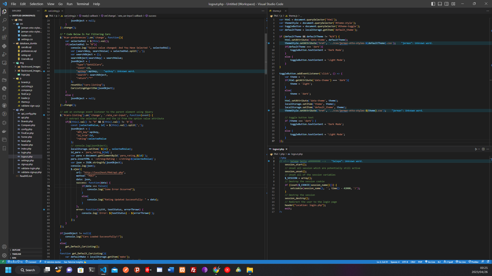

# Polishing Full Stack Development Skills: Preparing for an Impressive Portfolio Website!
---
- The `ultimate objective` is to construct exceptional web applications and mobile apps. By the end of this journey, I aspire to possess the ability to develop both `client` and `server software` proficiently. Moreover, I aim to master `HTML`, `CSS`, `Javascript`, `jQuery`, `AJAX`, `MySQL`, `PHP` and Many More, Including `PHP APIs`, and to be able to program a browser using popular frameworks such as JavaScript, jQuery, Angular and many more, as well as a server using renowned technologies such as PHP, ASP, Python, or Node.
---
- ### `Some of The Topics to be Covered Include`:
  - #### `LAMP Stack`
    - HTML
    - JavaScript
    - CSS
    - PHP
    - MySQL
  - #### `MEAN Stack`
    - MongoDB
    - ExpressJS
    - Angular
    - NodeJS
  - #### `Android and Hybrid Mobile Development`.
  - #### `Extra Topics`
    - XML
    - AJAX
    - JSON
    - JQuery
    - Bootstrap
    - TypeScript
    - Logs
    - Network protocols and sockets.
    - Distributed internet and blockchain.
    - Security (SQL database attacks, security, encryption, and hashing).
    - Other topics of current interest (Advanced Security, Cloud Computing, TailwindCSS).
---
---
# My Repo Directory Looks Like This So Far
- ### `README.md`
- ### `COS216`
  - #### `PA1`:
    - css
    - HTML
    - img
  - #### `PA2`:
    - css
    - HTML
    - img
    - js
  - #### `PA3`
    - css
        - jerman-otto-styles.css
        - loader.css
    - database_dumbs
        - carsdb.sql
        - Usersdb.sql
    - img
        - >Backround_Images
        - log.jpg
    - js
        - brands.js
        - carListing.js
        - compare.js
        - findCar.js
        - loader.js
        - validate-sign-up.js
    - php
        - api_confiq.php
        - api.php
        - Brands.php
        - Compare.php
        - config.php
        - FindCar.php
        - footer.php
        - head.php
        - header.php
        - index.php
        - login.php
        - logout.php
        - signup.php
        - validate-login.php
        - validate-signup.php
    - ReadME.md

  - #### `PA4` (FILES NOTE YET COMMITED!!):
    - DONE WITH THIS PART, TESTING IF EVERYTHING WORKS PERFECTLY (DELAYED UPLOADING JUST TO MAKE SURE EVERYTHING WORKS PERFECTLY).
    - css
        - jerman-otto-styles-dark.css
        - jerman-otto-styles-light.css
        - loader.css
        - settings.css
    - database_dumbs
        - carsdb.sql
        - preferences.sql
        - rating.sql
        - Usersdb.sql
    - img
        - > Backround_Images
        - > Backround_Images_Light
        - logo.jpg
    - js
        - brands.js
        - carListing.js
        - compare.js
        - findCar.js
        - loader.js
        - theme.js
        - validate-sign-up.js
    - php
        - api_confiq.php
        - api.php
        - Brands.php
        - Compare.php
        - config.php
        - FindCar.php
        - footer.php
        - head.php
        - header.php
        - index.php
        - login.php
        - logout.php
        - settings.php
        - signup.php
        - validate-login.php
        - validate-signup.php
    - ReadMe.md
    
    - 

- ### `index.html`
- ### `api.php`
- ### `...`
---
- # Name of imaginary Company: Jerman Otto:

    - 

---

# Topics In Brief Per PA Sub-Folder From 1 To 5 For The Cars Site
- # `PA1`
  - Created a web page which complies to the HTML5 standards and CSS styling.
    - http://validator.w3.org/, https://jigsaw.w3.org/css-validator/
    - ## `Functionality:`

      - A navbar from where navigation to each component/part is showcased.
      - A client must be able to navigate through all the PAs from the Launch Page.
      - An "under construction" page which is the page displayed if the tab has not as yet been completed.
      - Making sure that the web works in as many browsers as possible.
      - Layout, Backrounds, Fonts, Text, Boxes, Colours, Sizes and etc.
    - ### Workflow: Only HTML and CSS with Mock Data
      - Launch Page with Logo.
      - Navigation Bar on all created Pages.
      - Cars Page
        - Searchbar.
        - Filters.
        - Sort.
      - Branch Page
        - Brand Logo.
        - Name.
      - Find Me a Car Page
        - At least 6 Questions.
        - 4 Required.
        - 2 Optional.
      - Comapre Cars Page.
      - Under Construction.
    - Example Code HTML & CSS (Check jerman-otto-styles.css and Brands.html, Path: COS216/PA2)
      ```html
      <!DOCTYPE html>
      <html lang="en">
      <head>
          <meta charset="UTF-8">
          <title>Title</title>
          <meta name="author" content="Selepe Sello">
          <meta name="description" content="Example HTML & CSS Code For My ReadMe.md">
          <meta name="keywords" content="South Africa">
          <meta http-equiv="X-UA-Compatible" content="IE=edge">
          <meta name="viewport" content="width=device-width, initial-scale=1.0">
          <link rel="icon" href="../logo.jpg" type="image/icon type">
          <link rel="stylesheet" type="text/css" href="#" integrity="#" crossorigin="anonymous" referrerpolicy="no-referrer"/>
          <style>
              /* CSS for listing cars */
              .Example-CSS-For-Listing-Cars {
                  display: grid;
                  grid-template-columns: repeat(auto-fit, minmax(210px, auto));
                  grid-gap: 50px;
                  margin: 50px auto;
                  color: rgb(203, 242, 255);
                  max-width: 1240px;
                  padding: 20px;
                  border-radius: 15px;
                  background-color: rgba(0, 0, 0, 0.75);
              }
          </style>
      </head>
      <body class="background-brands">
          <header>
              <!-- Navigation -->
              <div class="topnav">
                  <a href="#"><i class="fa fa-home" aria-hidden="true"></i> Home</a>
              </div>
          </header>
          <section id="logo" class="mt-5">
              <!-- Logo placeholder -->
              
          </section>
          <div class="Example-CSS-For-Listing-Cars">
              <!-- Sample text for brands listing: Mock Data -->
              <p>Brand 1</p>
              <p>Brand 2</p>
              <p>Brand 3</p>
              <p>Brand 4</p>
              <p>Brand 5</p>
              <p>Brand 6</p>
          </div>
          <footer class="footer-bottom">
              <!-- Footer text and email link -->
              <p>Jerman Auto © 2023 All Rights Reserved! <i class="fab fa-linkedin"></i> <a href="mailto:sbkskhalo.kq@gmail.com">Email</a></p>
          </footer>
      </body>
      </html>
      ```
---
---
- # `PA2`
  - ### I will develop this using XAMP
    - Loading Screen.
    - JavaScript Animations.
    - JQuery for DOM manipulation.
    - Retrieving data from APIs.
    - Populating your templates with the retrieved API data.
    - Implementing the Find me a car page.
    - Implementing the Compare page.
  - ### API Functionality
    - AJAX.
    - JSON Manipulation.
    - Cars/Brands have the correct image pulled from the API.
    - DOM Manipulation.
    - All API calls are done through JavaScript AJAX XMLHttpRequest and jQuery.
    - The data from the API loads dynamically when the user views the page.
    - I used asynchronous so that the execution of one task doesn't dependent on another. Basically multiple tasks can run simultaneously.
  - #### Workflow: No Mock Data!!
    - CARS PAGE
      - Data Population -> Replace Mock Data from prev Cars Page.
      - Search, Filters and Sorting works.
      - Loading Screen.
    - BRANDS PAGE
      - Data Population -> Replace Mock Data from prev Brands Page.
      - Loading Screen
    - FIND ME A CAR
      - Correct results are Displayed.
      - Correct use of API parameters.
    - COMPARE PAGE
      - Car Selection works.
      - Compare Stats Show.
  - API Request Example Code (Check carListing.js, path: Path: COS216/PA2/js)
    ```javascript
    function carListingAlgorithm(jsonObject1) {
        var jsonObject;
        if (jsonObject1 === undefined) {
            jsonObject = {
                "studentnum": "uXXXXXXXX",
                "apikey": "a9198b68355f78830054c31a39916b7f",
                "type": "GetAllCars",
                "limit": 21,
                "return": ["make", "model", "body_type", "engine_type", "transmission", "max_speed_km_per_h"],
                "sort": "max_speed_km_per_h",
                "order": "DESC",
                "fuzzy": false
            };
            console.log("Please enter a valid request with at least one parameter");
            alert('Please enter a valid request with at least one parameter');
        }
        else {
            jsonObject = jsonObject1;
        }
        resetDiv("cars-listing");
        var json = JSON.stringify(jsonObject);
        $.ajax({
            url: `https://wheatley.cs.up.ac.za/api/`,
            method: "POST",
            data: json,
            success: function(response) {
                for (let k = 0; k < response.data.length; k++) {
                    var tempVar = response.data[k].make.toLowerCase();
                    createCars(tempVar, response.data[k]);
                }
            },
            error: function(jqXHR, textStatus, errorThrown) {
                console.log("Status code: " + jqXHR.status + " Status text: " + textStatus);
                console.log("Error thrown: " + errorThrown);
            }
        });
    }
    ```
---
---
- # `PA3`
  - Using a MySQL DB with PHP.
  - Create PHP API.
  - User Registration with an API.
  - API key Generation and Authorization.
  - I will use the PHP cURL library for the API  development.
  - Default login details (username and password) for a user I have on the API.
  - I will be using phpMyAdmin.
  - ### Workflow Setup:
    - #### READMe Specifying:
      - How to use the website
      - Explanations for the password requirements, choice of hashing algorithm and generation of API keys
    - #### Basic setup and page construction
      - Making use of the include function to stitch pages together.
        ```php
        <?php
            // file.php
            echo "This is the main file.";
            include "calculate.php";
            // Calling a function from the included PHP(calculate.php) file
            echo "The sum of 2 and 3 is " . GetSum(2, 3);
        ?>
        <!-- calculate.php -->
        <?php
            function GetSum($num1, $num2) {
                $sum = $num1 + $num2;
                return $sum;
            }
            function GetDifference($num1, $num2) {
                $diff = abs($num1 - $num2);
                return $diff;
            }
        ?>
        ```
      - config.php, header.php, footer.php, api.php
      - login.php, validate-login.php, logout.php
      - signup.php, validate-signup.php
      - Database (MySQL DB Dump)
      - Example of a database Dumb: `users.sql`
        ```sql
        CREATE DATABASE  IF NOT EXISTS `example_db`
        USE `example_db`;
        -- MariaDB dump 10.19  Distrib 10.7.3-MariaDB, for Win64 (AMD64)
        -- Remember to add your student number as the database name!
        -- Host: path/to/host    Database: example_db
        -- Server version	10.3.31-MariaDB-0+deb10u1
        -- Table structure for table `users`
        DROP TABLE IF EXISTS `users`;
        CREATE TABLE `users` (
            `id` int(11) NOT NULL AUTO_INCREMENT,
            `name` varchar(50) NOT NULL,
            `surname` varchar(50) NOT NULL,
            `email` varchar(100) NOT NULL,
            `password` char(30) NOT NULL,
            `time_created` int(11) NOT NULL,
            PRIMARY KEY (`id`),
            UNIQUE KEY `email` (`email`)
        ) ENGINE=InnoDB AUTO_INCREMENT=3 DEFAULT CHARSET=utf8mb4;
        -- Dumping data for table `users`
        LOCK TABLES `users` WRITE;
        -- Inserting values into the DB
        INSERT INTO `users` VALUES
        (1,'Default','User','default@u.c','d9d8c68a295f34ad3ef590a4b683f3',1652881570);
        -- DONE
        UNLOCK TABLES;
        -- Dump completed on 2022-05-19 12:15:54
        ```
      - User information includes the following fields:  "id", "name", "surname", ""email", "password", "API key".
  - #### User Registration
    - The goal is for the user to be able to enter in various details on a form on the signup page and register an account on the car website.
    - A signup-validation function which checks (using JavaScript and PHP)[i.e. Both client and server-side validation] whether the information is correct or not. If it is valid, the user is added to the relevant table in the database.
    - Making sure the user can easily register/login to the site.
    - Signup form on the signup page (signup.php) with the following fields:  "name", "surname", "email", "password".
    - Using JavaScript to check that all the fields are filled out correctly.
    - Email address should have an '@' symbol and the Password should be longer than 8 Characters.
    - The Password must also , contain Upper and Lower case Letters, at least One Digit and One Symbol (JS Regex will help).
    - Making use of POST to submit the form information to signup-validation.
        ```html
        <form method="post" action="signup-validation.php">
            <label for="name">Name:</label>
            <input type="text" id="name" name="name"><br>
            <label for="email">Email:</label>
            <input type="email" id="email" name="email"><br>
            <label for="password">Password:</label>
            <input type="password" id="password" name="password"><br>
            <input type="submit" value="Sign up">
        </form>
        ```
    - Add user to DB if it doesn't exist, hash password, Add salt, If user already exist an error must be dispayed!!.
  - #### Creating a PHP API
    - I will make use OOP to create the API class. File name "api.php".
    - API should only produce/consume structured JSON data.
    - I will be recreating a modified version the "Get All Cars" section of the API used for PA2 (API Documentation.html).
    - I should be able to use SQL Queries to extract data from the database dynamically.
    - In order to make server side external requests in PHP I will use the PHP cURL library.
    - ##### Additional Resources:
      - http://php.net/manual/en/curl.examples.php
      - https://stackoverflow.com/questions/3062324/what-is-curl-in-php
      - https://www.startutorial.com/articles/view/php-curl
    - The API should should be able to cater for invalid input by returning an error back that will be handled client side.
  - #### EXAMPLES
    - ## These are the Default Users for the Jerman Otto Cars Page:
      - #### `Default User 1`:
        - Name: Test
        - Surname: User
        - Email: testuser@tuks.co.za
        - Password: `@TestUser#564`
        - API_key: `a9198b68355f78830054c31a39916b7f`
      - #### `Default User 2`:
        - Name: John
        - Surname: Doe
        - Email: johndoe3@gmail.com
        - Password: `tEst@us5e#hd`
        - API_key: `K9yW8cGnE3qTfR7xV2sZ6bN1mJ4jL5p`
    - ##### FOR THE EXAMPLE REQUETS BELLOW, NB:=

      - The `studentnum` field is not being tested nor used on the API, It us just here for `fun/vibes`.
      - Please use the `API_keys` on the `database` to make requests to the REST API. They are included in `SECTION 1`
      - ##### Example 1: POST Request by User 1:
        ```json
        {
            "studentnum":"u12345678",
            "type":"GetAllCars",
            "limit":2,
            "apikey":"a9198b68355f78830054c31a39916b7f",
            "search":{
                "make":"BMW",
                "body_type":"Coupe"
            },
            "fuzzy": true,
            "sort":"id_trim",
            "order": "ASC",
            "return":[
                "id_trim","max_speed_km_per_h","body_type","engine_type","transmission","image"
            ]
        }
        ```
      - ##### Response form API
        ```json
        {
            "status": "success",
            "timestamp": 1680911562,
            "data": [
                {
                    "id_trim": "4417",
                    "max_speed_km_per_h": "250",
                    "body_type": "Coupe",
                    "engine_type": "Gasoline",
                    "transmission": "Manual",
                    "image": "https://wheatley.cs.up.ac.za/api/images/models/bmw_1m.jpg",
                    "image_brand": "https://wheatley.cs.up.ac.za/api/images/brands/bmw.png"
                },
                {
                    "id_trim": "4464",
                    "max_speed_km_per_h": "250",
                    "body_type": "Coupe",
                    "engine_type": "Gasoline",
                    "transmission": "Automatic",
                    "image": "https://wheatley.cs.up.ac.za/api/images/models/bmw_2 series.jpg",
                    "image_brand": "https://wheatley.cs.up.ac.za/api/images/brands/bmw.png"
                }
            ]
        }
        ```
      - ##### Example 2: POST Request by User 2:
        ```json
        {
            "limit":2,
            "apikey":"K9yW8cGnE3qTfR7xV2sZ6bN1mJ4jL5p",
            "search":{
                "make":"BMW",
                "body_type":"Coupe"
            },
            "fuzzy": true,
            "sort":"id_trim",
            "order": "ASC",
            "return":[
                "id_trim","max_speed_km_per_h","body_type","engine_type","transmission","image"
            ]
        }
        ```
      - ##### Response form API
        ```json
        {
            "status": "error",
            "timestamp": 1680912205,
            "data": "Error. Post parameters are Missing"
        }
        ```
  - ## Basic Setup Before Running the Codes
    - Import the `cars` table using the carsdb database dumb.
    - Import the `users` table using the usersdb database dumb, or alternatively
    - Create another table called `users` with the following fields: "id", "name", "surname", "email", "password", "API_key", "salt".
    - The `id` field should be `Automatically` generated, Using `AUTO_INCREMENT=1`
    - #### If You aren't Running the codes on wheatley:
      - At least Have Xampp installed
      - Copy the souce code to the httdoc directory
      - Run Apache and MySQL server
      - Use this URL to access the codes on XAMPP: "http://localhost/path/to/code/login.php"
  - ## How the Sign Up and Login Works:
    - A User must have an account to view the Cars for practical 3, and all the other pages.
    - If a user doesn't have an account they can only access the `signup`, `login` and `launch` pages.
    - A user can `create an account` and `login` without complications, I implemented The Sign Up and Login.
    - When a user submits the signup form, the `'required'` from HTML will make sure all fields are filled,
    - Then `JavaScript` will be loaded, And it will do signup validation on the `client side`.
    - Thereafter, If `javascript` is done, the form will be sent to `validate-signup.php` via `POST`.
    - This is to make sure the request is secured, Then `PHP` will do the validation on the `server side`.
    - Once all the validation is done, the user will be added to the 'users' database table.
    - ## `Sign Up Instructions:`
      - All Fields SHOULD Not Be `Empty`
      - The `NAME` and `SURNAME` fields SHOULD contain only Characters
      - The `EMAIL` SHOULD contain '@gmail.com' or '@tuks.co.za', and AT LEAST a Character on the LEFT.
      - Make sure the EMAIL doesn't contain `Illegal Characters`
      - Make sure the PASSWORD is at least `8 Characters` long and contains a `Number`, Contains a `Special Character`, `Uppercase` and `Lowercase` letters.
      - Make sure the PASSWORD doesn't contain Illegal Characters
      - The PASSWORD and CONFIRM PASSWORD SHOULD `match`
  - ##### This Is Implemented to make sure the Password is strong and it cannot be guessed or generated easily by Attackers.
  - ## How The Encryption Algorithm Works
    - Generate a `RANDOM` int, SALT value between `[2000000000, 2147483646]`.
    - Encrypt PASSWORD using the random number as the `salt` with "sha256" and hash_pbkdf2 method, `hash_pbkdf2("sha256", p, s, i, b)`;
    - Using 1000 iterations for the hash_pbkdf2 method, and a HASH length of 32 BYTES, So that it can fit well into a column of this size => `VARCHAR(128)`.
    - Finally i Concatenate the SALT and HASH and the encode the resulting string to base 64, using `base64_encode()`.
  - ## API Key
    - The API key is an `Alphanumeric` string of `length=32`.
    - It Contains these Characters: `0123456789abcdefghijklmnopqrstuvwxyzABCDEFGHIJKLMNOPQRSTUVWXYZ`
    - The Key is then Displayed to the User using an alert.
---
---
- # `PA4`
  - #### `ONLY REGISTERED USERS WILL HAVE ACCESS TO THE PAGES`
  - Populating data using the API i created in PA3
    - Adding more `filters` to the API
    - Or modifying the Client side to work with the available filters.
  - Cookie or Local DOM Storage
    - Storing the `API key` in the `Local DOM Storage`.
    - Using the API key to send `Requests` to the `API` in the `Server-Side`.
  - Themes (`dark` and `light`)
    - Using DOM Storage to keep the user preferences so that they are `saved` and remembered when the user `loads` the site
    - Theme must be `dynamically` updated such that the user `doesn't` need to `reload` the page every time after the theme is loaded.
    - The user must be able to save these `default settings` in the settings page.
    - Example: THeme Implimentation in `javaScript`.
    - ```javascript
        var html = document.querySelector('html');
        var themeStyle = document.querySelector('#theme-style');
        var toggleButton = document.querySelector('#theme-toggle');
        var defaultTheme = localStorage.getItem('default_theme');

        if (defaultTheme && defaultTheme != "N/A") {
            html.setAttribute('data-theme', defaultTheme);
            themeStyle.setAttribute('href', `../css/jerman-otto-styles-${defaultTheme}.css`);
            if(defaultTheme === 'dark'){
                toggleButton.textContent = 'Dark Mode';
            }
            else {
                toggleButton.textContent = 'Light Mode';
            }
        }

        toggleButton.addEventListener('click', () => {
            var theme = '';
            if(html.getAttribute('data-theme') === 'dark'){
                theme = 'light';
            }
            else{
                theme = 'dark';
            }
            html.setAttribute('data-theme', theme);
            localStorage.setItem('theme', theme);
            localStorage.setItem('default_theme', theme);
            themeStyle.setAttribute('href', `../css/jerman-otto-styles-${theme}.css`);

            // toggle button text
            if (theme === 'dark') {
                toggleButton.textContent = 'Dark Mode';
            }
            else {
                toggleButton.textContent = 'Light Mode';
            }
        });
        ```
  - `UPDATE` PHP API type
    - Allowing the user to `change` their preferences.
    - Preferences are the filters used in the previous PAs
    - Making sure the filters are always applied(until changes are made).
    - Implementing the functionality for `storing` and `updating` data on the `database`.
    - There must be a settings page for saving preferences.
    - Using the API to `return preferences` from the database and storing them in DOM storage.
  - Implementing the ability to `rate` cars on the Cars page.
  - Showing the `average rating` of the cars on the cars page from all users.
---
---
## REQUIREMENTS BEFORE RUNNING THE CODES:
- ### `A Text Editor`:
  - A text editor is required to create, write and edit code.
  - There are many free and paid text editors available online such:
    - Visual Studio Code
    - Sublime Text
    - Notepad++
    - Atom.
  - VS Code: [Instalation Guide](https://www.youtube.com/watch?v=4zVObKFZ6fA&ab_channel=TheCodeholic)
- ### `Web Server`:
  - A web server is required to serve web pages to users.
  - You can use an existing web server like Apache or Nginx, or you can use a package like XAMPP or WAMP which comes with an integrated web server.
  - ##### `Xampp Instalation Guide`:
    - [Windows 10](https://www.youtube.com/watch?v=-f8N4FEQWyY&ab_channel=edureka%21)
    - [Windows 11](https://www.youtube.com/watch?v=VQpATELDSEI&ab_channel=ProgrammingKnowledge2)
  - Once `Xampp` is available:
    - Copy the souce code to the httdoc directory
    - Run `Apache` and `MySQL` server
    - url:  `"http://localhost/path/to/code/login.php"`
- ### `HTML`:
  - Hypertext Markup Language is used to create the structure and content of web pages.
  - You need a text editor to create HTML files with an ".html" extension.
- ### `CSS`:
  - Cascading Style Sheets are used to style the HTML content.
  - You need a text editor to create CSS files with a ".css" extension.
- ### `JavaScript`:
  - JavaScript is used to add interactivity and functionality to web pages.
  - You need a text editor to create JavaScript files with a ".js" extension.
- ### `PHP`:
  - PHP is a server-side scripting language used for dynamic web content.
  - You need a web server that supports PHP to run PHP scripts.
- ### `AJAX`:
  - Asynchronous JavaScript and XML are used to update web content without refreshing the page.
  - You need JavaScript and a web server that supports AJAX.
  - AJAX Example For Just Control
    ```php
    <!DOCTYPE html>
    <html>
    <head>
        <title>AJAX Example For Control</title>
        <script>
            function loadData() {
                var requestVariable = new XMLHttpRequest(); // Object
                requestVariable.onreadystatechange = function() {
                    if (this.readyState == 4 && this.status == 200) {
                        // DOM Manipulation
                        document.getElementById("example_id").innerHTML = this.responseText;
                    }
                };
                requestVariable.open("GET", "URL", true); // asynchronous
                requestVariable.send(); // Send the request
            }
        </script>
    </head>
    <body>
        <h1>AJAX Example For Control</h1>
        <!-- Calls loadData() when the button is clicked -->
        <button type="button" onclick="loadData()">Load Data</button>
        <p id="example_id"></p>
    </body>
    </html>
    ```
- ### `jQuery`:
  - jQuery is a JavaScript library that simplifies HTML document manipulation, event handling, and animation.
  - You need to include jQuery in your HTML file by linking to it in your code.
  - The Same AJAX Example Using jQuery Just For Control
    ```php
    <!DOCTYPE html>
    <html>
    <head>
        <title>AJAX Example For Control</title>
        <!-- Including jQuery Library in out file -->
        <script src="https://ajax.googleapis.com/ajax/libs/jquery/3.6.0/jquery.min.js"></script>
        <script>
            $(document).ready(function() {
                $("#exampleButton").click(function() {
                    $.get("URL", function(data) {
                        // DOM Manipulation
                        $("#example_id").html(data);
                    });
                });
            });
        </script>
    </head>
    <body>
        <h1>AJAX Example For Control</h1>
        <button type="button" id="exampleButton">Load Data</button>
        <p id="example_id"></p>
    </body>
    </html>
    ```
- ### `Web Browsers`:
  - A web browser is necessary to render and display web pages.
  - Popular web browsers include:
    - Google Chrome
    - `Mozilla Firefox`
    - Safari
    - Microsoft Edge
    - `Brave`
    - Opera
    - Not Recommended: `Tor (Onion Routing)`
---

<p align=center>** THE END LOADING **<p>

---
---
